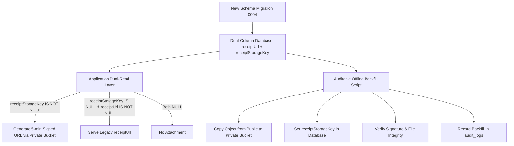

# Receipt Storage Migration & Backward Compatibility Strategy

**Project:** Graceful Giving (CFOS)  
**Date:** September 2026  
**Status:** DRAFT / PRE-DATABASE VERIFICATION  
**Scope:** Expense receipts, storage privacy hardening, and legacy record compatibility

---

## 1. Executive Summary

Historically, Graceful Giving stored church expense receipt attachments as direct public URLs in the `expenses.receiptUrl` column, uploaded to a public Supabase Storage bucket (`receipts`). Financial vouchers, tax deduction records, and vendor invoices contain sensitive institutional and personal information (banking details, tax IDs, vendor names, and personal signatures) that must not be exposed to the public Internet.

The architecture is transitioned to a **Zero-Public-Access Private Storage Model**:
```text
Client Upload (Finance Role)
  → Base64 / Stream to Server
  → Server verifies Church Tenant & Role (TREASURER / SUPER_ADMIN)
  → Supabase Storage Private Bucket (service role upload)
  → Database stores ONLY the object key: receiptStorageKey
  → Download / View strictly gated:
      Client requests view (with session cookie)
      → Authorization & Tenant verification
      → Short-lived 5-minute signed URL generated on-demand
      → No permanent public URL ever stored or leaked
```

To prevent irreversible data loss and maintain financial audit integrity, **no existing legacy `receiptUrl` data will be dropped, overwritten, or deleted**. This document details the exact repository scan, inventory of read/write points, and the auditable migration strategy.

---

## 2. Repository Inventory: Receipt Read & Write Touchpoints

A repository-wide scan for `receiptUrl`, `receiptStorageKey`, `storagePut`, and `storagePutPrivate` reveals the following architectural footprint:

### 2.1 Points Reading `receiptUrl`

| Component / File | Line(s) | Context / Behavior |
|---|---|---|
| `drizzle/schema.ts` | 355 | Defines `receiptUrl: text("receiptUrl")` in the `expenses` table. |
| `server/db.ts` | 683, 718, 751 | `ExpenseRow` interface includes `receiptUrl: string | null`. `getExpenseById` and `listExpenses` select `receiptUrl`. |
| `server/routers.ts` | 596, 609, 660 | `expenses.list` and `expenses.getById` procedures return `receiptUrl` to authorized clients. |
| `client/src/pages/Expenses.tsx` | 77, 343, 388, 454, 481, 509 | Renders receipt preview icon/button in desktop table and mobile card view when `e.receiptUrl` is truthy. |
| `client/src/pages/TransactionDetail.tsx` | 171, 392, 412, 425, 458, 468 | Displays thumbnail or PDF link of receipt attachment and opens preview modal. |
| `client/src/components/finance/ReceiptPreviewModal.tsx` | 7, 15, 19, 21, 40, 67, 79 | Modal component displaying zoomable image or PDF viewer via `<a href={receiptUrl}>` and ``. |
| `client/src/components/finance/VoucherModal.tsx` | 19, 203, 210 | Official printable A4 payment voucher displaying clickable link to receipt attachment. |
| `server/schema_init.ts` | 143 | Fallback DDL execution: `ALTER TABLE "expenses" ADD COLUMN IF NOT EXISTS "receiptUrl" text;`. |

### 2.2 Points Writing `receiptUrl`

| Component / File | Line(s) | Context / Behavior |
|---|---|---|
| `server/routers.ts` | 609 | `expenses.create`: Inserts `receiptUrl: input.receiptUrl ?? null` into the database. |
| `server/routers.ts` | 660 | `expenses.update`: Updates `receiptUrl` if provided in mutation payload. |
| `server/routers.ts` | 641 | `expenses.uploadReceipt`: Calls legacy `storagePut()`, which uploads to public bucket and returns `{ url: publicUrl }`. |
| `client/src/pages/NewExpense.tsx` | 48, 128, 482 | Stores uploaded URL in local component state `receiptUrl` and passes it to `expenses.create.mutate()`. |

### 2.3 Storage Upload Helpers

| Helper | File & Lines | Current Behavior | Target Behavior |
|---|---|---|---|
| `storagePut` | `server/storage.ts:34-72` | Uploads file to `SUPABASE_STORAGE_BUCKET` (`receipts`), returns public URL `/storage/v1/object/public/...`. | **Deprecate for receipts.** Retain only for non-sensitive public assets if needed. |
| `storagePutPrivate` | `server/storage.ts:137-170` | Uploads file to `SUPABASE_SLIP_BUCKET` (`slips`), returns `{ key }` only. No public URL. | **Target standard.** Extended to support expense receipts under private receipt path. |
| `storageGetSignedUrl` | `server/storage.ts:79-97` | Mints signed URL for `SUPABASE_STORAGE_BUCKET` (1 hour). | Change expiration to 300 seconds (5 minutes) for financial compliance. |
| `getSlipSignedUrl` | `server/storage.ts:176-206` | Mints signed URL for `SUPABASE_SLIP_BUCKET` (1 hour). | Change expiration to 300 seconds (5 minutes). |

---

## 3. Legacy Records & Data Integrity

### 3.1 Legacy Record Characteristics
- Existing records in production/staging contain `expenses.receiptUrl` formatted as:
  `https://<project-ref>.supabase.co/storage/v1/object/public/receipts/receipts/<timestamp>-<filename>_<uuid8>.<ext>`
- These records have `receiptStorageKey = NULL`.
- Deleting or altering `receiptUrl` immediately breaks historical voucher verification and legal audit compliance.

### 3.2 Non-Negotiable Data Safety Rules
1. **Never drop `receiptUrl` column** in initial migrations.
2. **Never overwrite existing `receiptUrl` values** with NULL or relative keys.
3. **Dual-column coexistence**: `receiptUrl` (legacy public URL) and `receiptStorageKey` (new private object key) coexist.
4. **Zero Downtime**: Database queries must gracefully handle records with either field populated.

---

## 4. Phased Migration Strategy



### Phase 1: Schema Extension (Migration 0004)
Run migration `0004_private_expense_receipts.sql`:
```sql
ALTER TABLE "expenses" ADD COLUMN IF NOT EXISTS "receiptUrl" text;
ALTER TABLE "expenses" ADD COLUMN IF NOT EXISTS "receiptStorageKey" varchar(500);
CREATE INDEX IF NOT EXISTS "expenses_receipt_storage_key_idx" 
  ON "expenses" ("churchId", "receiptStorageKey") 
  WHERE "receiptStorageKey" IS NOT NULL;
```
*Result:* Database accepts new records with `receiptStorageKey` while preserving all existing `receiptUrl` data.

### Phase 2: Dual-Read API Resolution
Create an internal helper in `server/db.ts` / `server/routers.ts`:
```typescript
export async function resolveExpenseReceiptUrl(expense: {
  receiptStorageKey?: string | null;
  receiptUrl?: string | null;
}): Promise<string | null> {
  // Priority 1: Private storage key -> mint 5-minute signed URL
  if (expense.receiptStorageKey) {
    return await getPrivateReceiptSignedUrl(expense.receiptStorageKey, 300);
  }
  // Priority 2: Fallback to existing legacy receiptUrl
  if (expense.receiptUrl) {
    return expense.receiptUrl;
  }
  return null;
}
```
*Result:* Frontend receives a resolved, temporary `receiptUrl` regardless of whether the record is legacy or new. Frontend code requires zero breaking changes.

### Phase 3: Auditable Backfill Script
An idempotent, non-destructive migration script (`scripts/migrate-legacy-receipts.ts`):
1. Selects batches of expenses where `receiptUrl IS NOT NULL` AND `receiptStorageKey IS NULL`.
2. Extracts the relative object key from the legacy Supabase public URL:
   - Example URL: `https://xyz.supabase.co/storage/v1/object/public/receipts/receipts/20260901-invoice.pdf`
   - Parsed Key: `receipts/20260901-invoice.pdf`
3. Copies the object from public bucket `receipts` to private bucket `receipts-private` via Supabase Storage API (`copyObject`).
4. Updates the database row:
   ```sql
   UPDATE "expenses"
   SET "receiptStorageKey" = $1, "updatedAt" = NOW()
   WHERE "id" = $2 AND "receiptStorageKey" IS NULL;
   ```
5. Writes an entry to `audit_logs`:
   ```json
   {
     "action": "MIGRATE_RECEIPT_STORAGE",
     "entity": "expenses",
     "entityId": 123,
     "metadata": {
       "legacyUrl": "https://...",
       "newStorageKey": "receipts/...",
       "migratedAt": "2026-09-23T00:00:00Z"
     }
   }
   ```
6. **Preserves `receiptUrl` unchanged** until 100% verification is complete across all financial quarters.

---

## 5. Backward Compatibility Verification Checklist

- [x] Schema: `receiptUrl` column retained as nullable `text`.
- [x] Schema: `receiptStorageKey` column added as nullable `varchar(500)`.
- [x] Drizzle ORM model: Both fields typed and available in `Expense` type.
- [x] Voucher generation: `VoucherModal.tsx` prints receipt link from either legacy or signed URL.
- [x] Receipt preview: `ReceiptPreviewModal.tsx` functions identically for both legacy URLs and signed URLs.
- [x] Audit trail: Every migration mutation logged in `audit_logs`.
- [x] No data loss: Zero DELETE statements or DROP COLUMN operations in any migration.
